# Gym - Modern Android Fitness Tracking App

A comprehensive fitness tracking application built with modern Android technologies. Track workouts, manage fitness goals, follow coach-assigned routines, and monitor your progress with an intuitive Material 3 design.

## Tech Stack

- **UI**: Kotlin + Jetpack Compose (100% Jetpack Compose, no XML layouts)
- **Navigation**: Jetpack Navigation Compose
- **Database**: Room Database with KSP (Kotlin Symbol Processing)
- **Architecture**: MVVM with AndroidX ViewModel
- **Dependency Injection**: Manual injection via custom `GymViewModelFactory` (no Hilt)
- **Authentication**: Biometric support via AndroidX Biometric
- **Image Loading**: Coil for Compose
- **JSON Serialization**: GSON for data persistence
- **Async**: Kotlin Coroutines
- **Theming**: Material 3 with dark/light mode support

## Features

### Authentication & User Accounts
- Login screen with email/password authentication
- Biometric (fingerprint/face) login support
- Sign-up flow for new users
- Coach and athlete account types
- Session persistence with secure storage

### User Profiles
- User profile with name, age, weight, and fitness goals
- Weight unit selection (pounds or kilograms)
- Profile picture support
- Editable profile information with validation
- Separate profile display and edit screens

### Workout Management
- **Home Screen**: Dashboard showing:
  - Welcome message with user's first name
  - Quick access to main features
  - Recent activity summary
  
- **Exercise Library**: Organized by:
  - **Muscle Groups**: Chest, Back, Shoulders, Biceps, Triceps, Quads, Hamstrings, Glutes, Calves, Core, Full Body, Forearms
  - **Workout Types**: Strength, Yoga, Stretching, Cardio, Calisthenics, Balance, Core, Isometric, Plyometric
  - **Equipment**: Bodyweight, Dumbbell, Barbell, Cable, Machine, Kettlebell
  - **Detail Screens**: Each exercise has form guidance and images

### Scheduling & Progress
- **Schedule Screen**: Book training sessions with trainers within a week range
- **Progress Screen**: Track fitness progress with:
  - Total workouts completed
  - Recent activity log
  - Progress entries with timestamps
- **Trainer Assignment**: Coaches can assign athletes workout routines for specific days

### Settings & Preferences
- Dark/light theme toggle
- 12-hour or 24-hour time format preference
- Theme persistence across sessions

## Screenshots

Mini carousel (GitHub-friendly, no JavaScript): use the slide links below.

`[1]` [Auth](#slide-1-auth) • `[2]` [Home/Exercise](#slide-2-home-exercise) • `[3]` [Workouts](#slide-3-workouts) • `[4]` [Profile](#slide-4-profile) • `[5]` [Schedule/Progress](#slide-5-schedule-progress) • `[6]` [Settings](#slide-6-settings)

### Slide 1 - Auth
<a id="slide-1-auth"></a>
<p>
  <a href="screenshots/01_login_screen_light.png">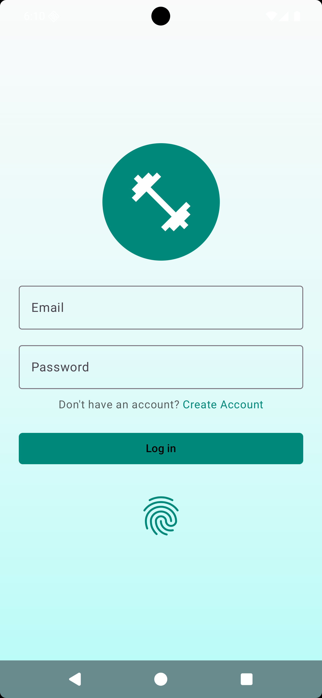</a>
  <a href="screenshots/02_login_screen_dark.png">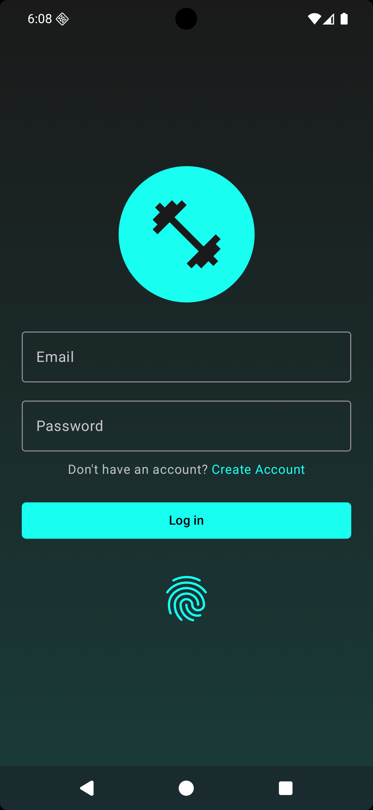</a>
  <a href="screenshots/03_signup_screen_light.png">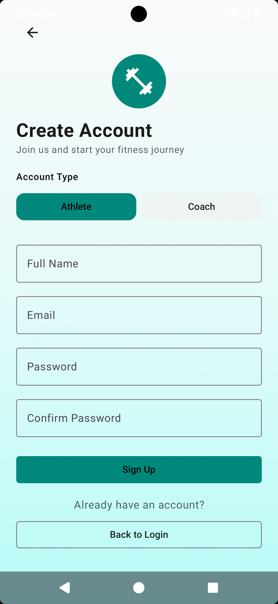</a>
  <a href="screenshots/04_signup_screen_dark.png">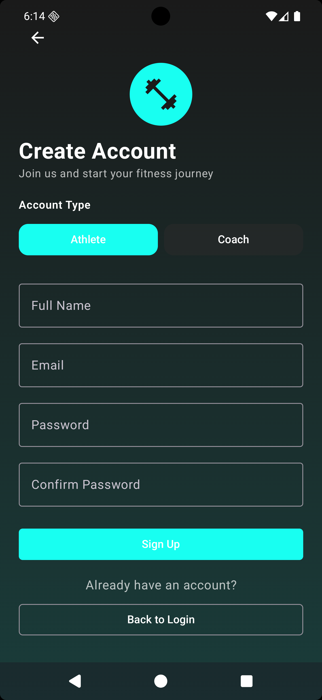</a>
  <a href="screenshots/07_profile_creation_screen_light.png">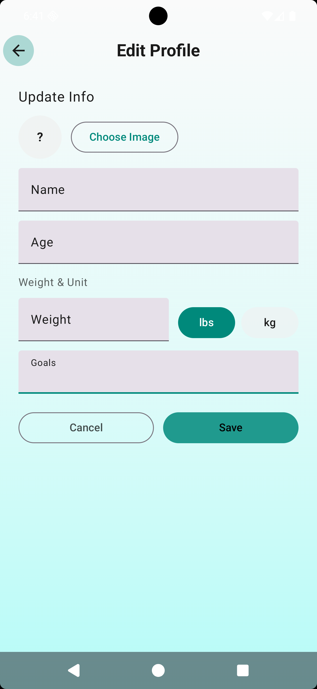</a>
  <a href="screenshots/08_profile_creation_screen_dark.png">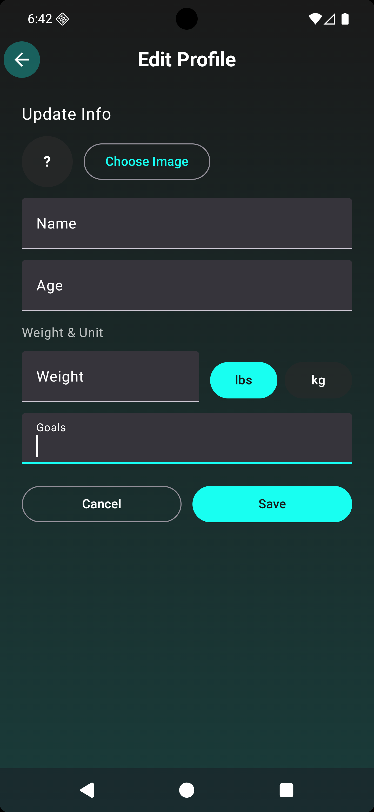</a>
</p>

Next: [Slide 2](#slide-2-home-exercise)

### Slide 2 - Home and Exercise
<a id="slide-2-home-exercise"></a>
<p>
  <a href="screenshots/10_home_screen_dark.png">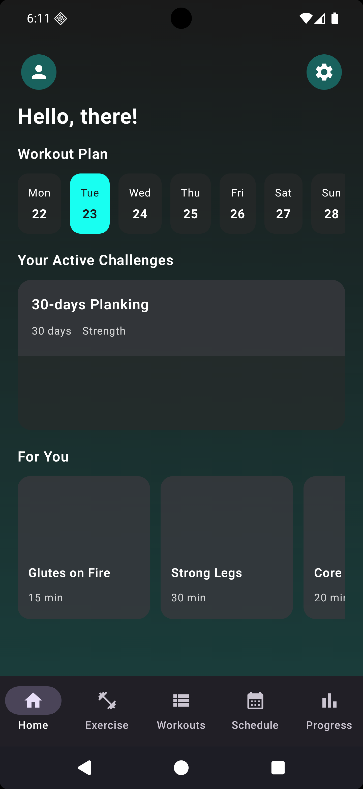</a>
  <a href="screenshots/11_exercise_tab_screen_light.png">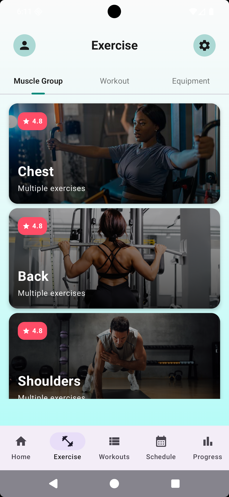</a>
  <a href="screenshots/12_exercise_tab_screen_dark.png">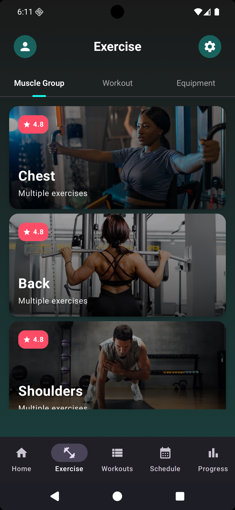</a>
  <a href="screenshots/14_muscle_group_list_dark.png">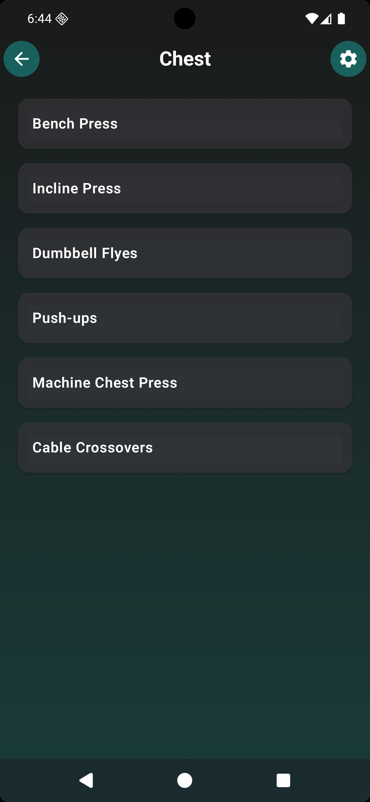</a>
</p>

Prev: [Slide 1](#slide-1-auth) • Next: [Slide 3](#slide-3-workouts)

### Slide 3 - Workouts
<a id="slide-3-workouts"></a>
<p>
  <a href="screenshots/22_workout_list_dark.png">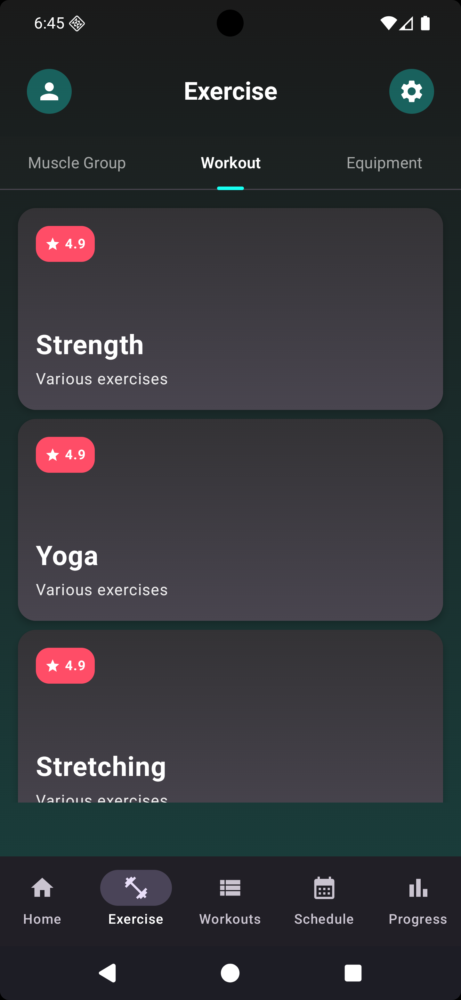</a>
  <a href="screenshots/23_add_edit_workout_light.png">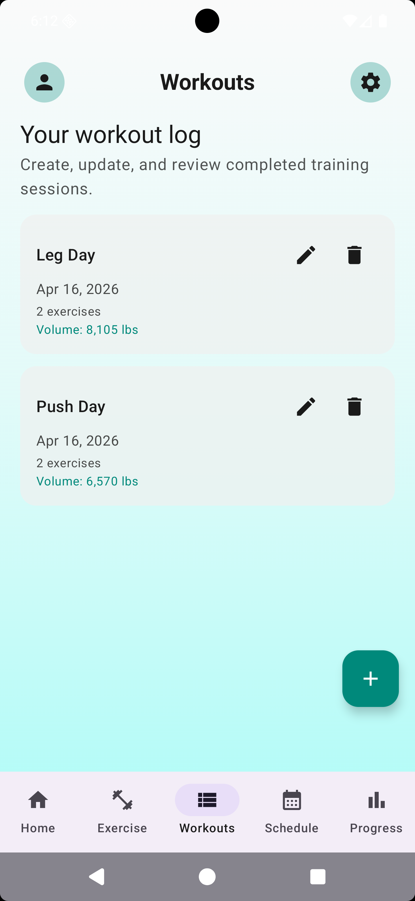</a>
  <a href="screenshots/24_add_edit_workout_dark.png">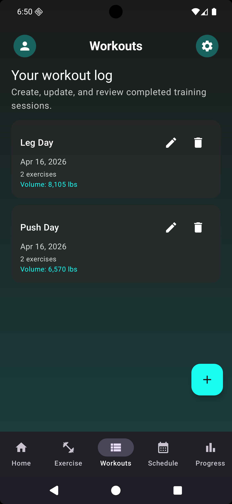</a>
</p>

Prev: [Slide 2](#slide-2-home-exercise) • Next: [Slide 4](#slide-4-profile)

### Slide 4 - Profile
<a id="slide-4-profile"></a>
<p>
  <a href="screenshots/30_profile_screen_dark.png">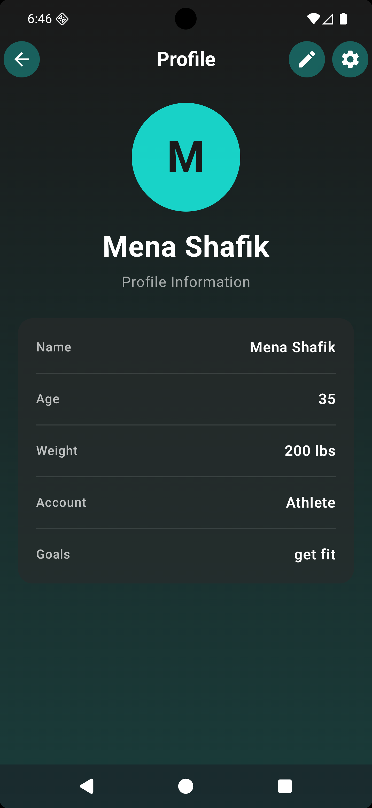</a>
</p>

Prev: [Slide 3](#slide-3-workouts) • Next: [Slide 5](#slide-5-schedule-progress)

### Slide 5 - Schedule and Progress
<a id="slide-5-schedule-progress"></a>
<p>
  <a href="screenshots/33_schedule_screen_light.png">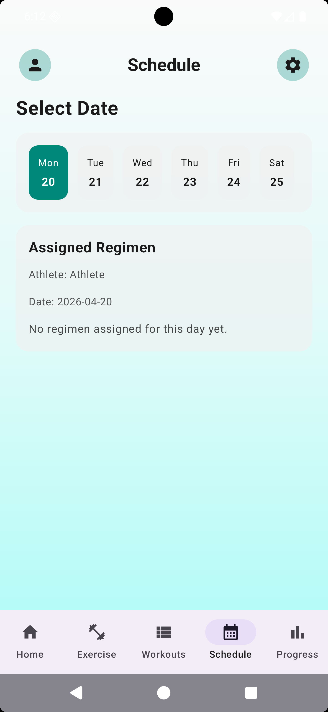</a>
  <a href="screenshots/34_schedule_screen_dark.png">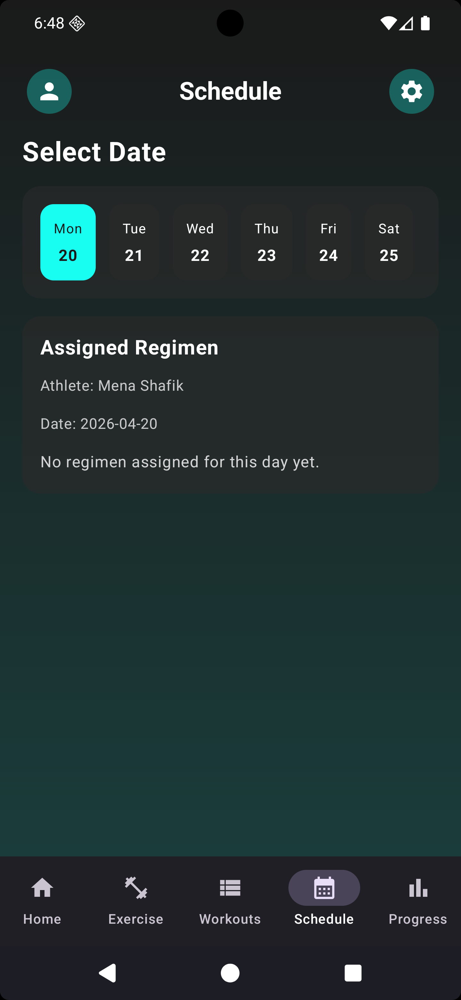</a>
  <a href="screenshots/35_progress_screen_light.png">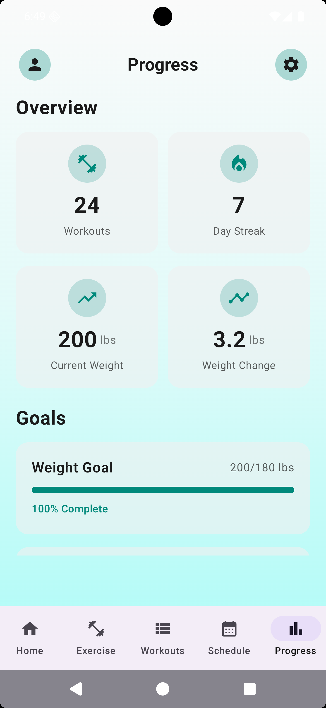</a>
  <a href="screenshots/36_progress_screen_dark.png">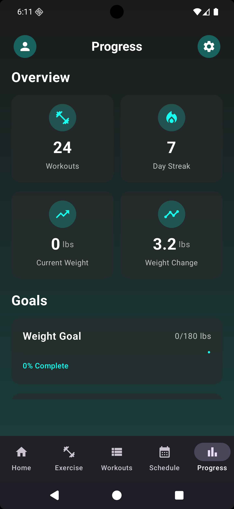</a>
</p>

Prev: [Slide 4](#slide-4-profile) • Next: [Slide 6](#slide-6-settings)

### Slide 6 - Settings
<a id="slide-6-settings"></a>
<p>
  <a href="screenshots/37_settings_screen_light.png">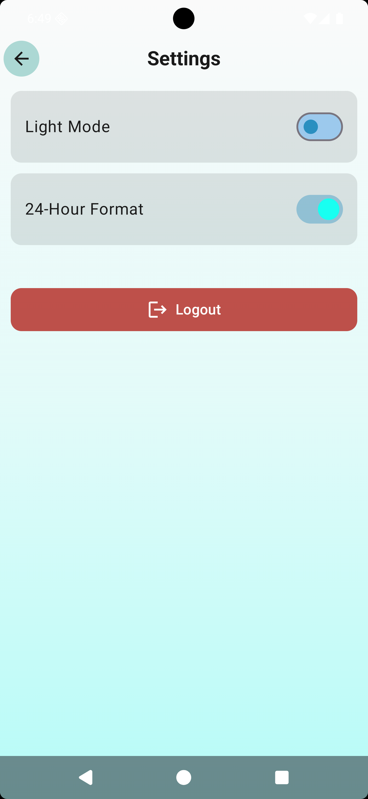</a>
  <a href="screenshots/38_settings_screen_dark.png">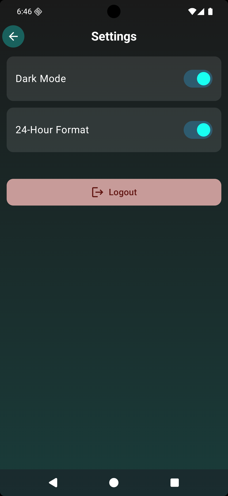</a>
</p>

Prev: [Slide 5](#slide-5-schedule-progress) • Back to: [Slide 1](#slide-1-auth)

## Implemented Screens

| Route | Screen | Description |
|-------|--------|-------------|
| `login` | Login Screen | Email/password authentication with biometric option and saved email |
| `sign_up` | Sign Up Screen | New user registration with account type selection (Athlete/Coach) |
| `biometric_login` | Biometric Login | Fingerprint/face authentication with fallback to password |
| `profile_creation` | Profile Creation | Complete profile onboarding after sign-up (age, weight, goals, picture) |
| `home` | Home Screen | Dashboard with user greeting, quick stats, and recent activity |
| `exercise` | Exercise Library | Tabbed interface (Muscle Groups, Workout Types, Equipment) |
| `muscle_group_exercises` | Muscle Group List | List of exercises by muscle group with images |
| `exercise_detail` | Exercise Details | Form guidance and images for specific exercise |
| `workout_type_exercises` | Workout List | List of workout types (Strength, Yoga, Cardio, etc.) |
| `workout_detail` | Workout Details | Details and form tips for workout type |
| `equipment_exercises` | Equipment List | List of exercises by equipment type |
| `equipment_detail` | Equipment Details | Form guidance for equipment-specific exercises |
| `workouts` | Workouts List | List of user's saved workouts with edit/delete options |
| `add_edit_workout` | Add/Edit Workout | Create or modify workout with exercise rows |
| `profile` | User Profile | Display profile information with edit button |
| `profile_edit` | Edit Profile | Modify user details (age, weight, goals, picture) with validation |
| `schedule` | Schedule Screen | Book training sessions with trainers within a week range |
| `progress` | Progress Screen | View fitness progress, recent activity, and statistics |
| `settings` | Settings Screen | Adjust app preferences (theme, time format) and logout |

## Project Structure

```
app/src/main/java/com/example/gym/
├── MainActivity.kt                      # Entry point with theme management
├── GymApp.kt                            # App-level composable
│
├── navigation/
│   ├── NavGraph.kt                      # Navigation graph definition
│   ├── Routes.kt                        # Route enum definitions
│   └── BottomNavItem.kt                 # Bottom navigation items
│
├── ui/
│   ├── screens/
│   │   ├── LoginScreen.kt               # Login with email/password
│   │   ├── BiometricLoginScreen.kt      # Biometric authentication
│   │   ├── SignUpScreen.kt              # User registration
│   │   ├── HomeScreen.kt                # Dashboard
│   │   ├── SettingsScreen.kt            # App preferences
│   │   ├── ProgressScreen.kt            # Fitness progress
│   │   ├── ScheduleScreen.kt            # Schedule sessions
│   │   ├── profile/
│   │   │   ├── ProfileScreen.kt         # Profile display
│   │   │   └── ProfileEditScreen.kt     # Edit profile info
│   │   ├── exercises/
│   │   │   ├── ExerciseTabScreen.kt     # Tabbed exercise library
│   │   │   ├── MuscleGroupScreen.kt     # Muscle group list
│   │   │   ├── MuscleGroupDetailScreen.kt # Muscle group exercises
│   │   │   └── ExerciseDetailScreen.kt  # Exercise form guidance
│   │   ├── workout/
│   │   │   ├── WorkoutScreen.kt         # Workout type list
│   │   │   ├── WorkoutDetailScreen.kt   # Workout details
│   │   │   └── [Similar structure as exercises]
│   │   └── equipment/
│   │       ├── EquipmentScreen.kt       # Equipment list
│   │       ├── EquipmentDetailScreen.kt # Equipment details
│   │       └── [Similar structure as exercises]
│   │
│   ├── composables/
│   │   ├── ProfileSettingsHeader.kt     # Top bar with profile/settings icons
│   │   ├── BottomNavBar.kt              # Bottom navigation component
│   │   ├── ExerciseCard.kt              # Reusable exercise card
│   │   ├── WorkoutPlanRow.kt            # Workout plan list item
│   │   └── [Other reusable composables]
│   │
│   ├── theme/
│   │   ├── Color.kt                     # Color definitions
│   │   ├── Typography.kt                # Typography settings
│   │   └── Theme.kt                     # Material 3 theme
│   │
│   ├── viewmodel/
│   │   ├── GymViewModelFactory.kt        # ViewModel factory for manual DI
│   │   ├── ProfileViewModel.kt           # Profile screen state
│   │   ├── ProgressViewModel.kt          # Progress screen state
│   │   ├── WorkoutViewModel.kt           # Workout management state
│   │   └── [Other ViewModels]
│   │
│   ├── UserProfile.kt                   # User profile state management
│   └── utils/
│       └── [Utility functions]
│
├── data/
│   ├── local/
│   │   ├── AppDatabase.kt               # Room database setup with KSP
│   │   ├── Daos/
│   │   │   ├── WorkoutDao.kt
│   │   │   ├── ExerciseDao.kt
│   │   │   └── [Other DAOs]
│   │   └── entities/
│   │       ├── Workout.kt               # Workout entity
│   │       ├── Exercise.kt              # Exercise entity
│   │       └── [Other entities]
│   │
│   ├── model/
│   │   ├── Workout.kt                   # Data models
│   │   ├── Exercise.kt
│   │   ├── MuscleGroup.kt
│   │   ├── Equipment.kt
│   │   └── [Other models]
│   │
│   ├── repository/
│   │   ├── WorkoutRepository.kt          # Workout data layer
│   │   ├── ExerciseRepository.kt         # Exercise data layer
│   │   └── [Other repositories]
│   │
│   ├── storage/
│   │   └── UserPreferences.kt            # Shared preferences wrapper
│   │
│   ├── auth/
│   │   └── AuthManager.kt                # Authentication logic
│   │
│   └── utils/
│       └── [Data utility functions]
│
├── domain/
│   └── model/
│       ├── WorkoutRecord.kt              # Domain-level models
│       └── [Other domain models]
│
└── model/
    └── [Additional models]
```

## Database Schema

### Key Entities
- **Workout**: Stores workout sessions
  - Fields: id, name, date, duration, notes
  
- **Exercise**: Individual exercises
  - Fields: id, name, sets, reps, weight, muscleGroup
  
- **UserProfile**: User information
  - Fields: id, name, age, weight, weightUnit, goals
  
- **ProgressEntry**: Progress tracking
  - Fields: id, date, workoutCount, notes

All entities use Room's primary keys, foreign keys, and relationships. Schema exports are stored in `app/schemas/`.

## Architecture Highlights

### MVVM Pattern
- **Models**: Data classes representing domain entities
- **ViewModels**: Manage UI state using StateFlow/MutableState
- **Views**: Jetpack Compose UI composables

### Manual Dependency Injection
The app uses `GymViewModelFactory` to manually instantiate ViewModels with their dependencies:
```kotlin
val factory = GymViewModelFactory(
    workoutRepository = WorkoutRepository(database.workoutDao()),
    exerciseRepository = ExerciseRepository(database.exerciseDao()),
    // ... other dependencies
)
val viewModel = factory.create(WorkoutViewModel::class.java)
```

### Repository Pattern
- Abstracts data sources (local Room database)
- Provides reactive data streams via Flow
- Handles business logic and data transformations

## Theme System

### Material 3 Design
- Supports dynamic color generation on Android 12+
- Custom color palette for consistency
- Smooth transitions between themes

### Dark/Light Mode
- Soft white theme for light mode with teal accents
- Dark theme with soft black background and neon teal gradient
- Persistent theme preference in user settings
- Proper text color contrast (black on light, white on dark)

## Key Features Implementation

### Biometric Authentication
- Uses AndroidX Biometric library
- Fallback to password authentication
- Secure credential storage

### Form Validation
- Numeric-only input for age and weight
- Email validation on login/signup
- Required field validation
- User-friendly error messages

### State Management
- Sealed classes for UI states (Loading, Content, Error, Empty)
- Coroutines for async operations
- Flow for reactive data updates

### Image & Resource Management
- Coil for remote image loading
- Local drawable resources for exercise forms
- Placeholder images for user profiles

## Running the App

### Build & Run
```bash
cd "C:/Users/Mena/AndroidStudioProjects/Gym"
./gradlew :app:assembleDebug
```

### Run Tests
```bash
# Unit tests
./gradlew :app:testDebugUnitTest

# Instrumented tests
./gradlew :app:connectedAndroidTest
```

### Run Specific Tests
```bash
./run-tests.bat  # Windows
./run-tests.sh   # Unix/Mac
```

## Development Notes

### KSP Configuration
- Room compiler is configured via KSP in `app/build.gradle.kts`
- Schema location: `app/schemas/`
- No KAPT dependency needed

### Dummy Data
- Database is pre-seeded with exercise library data
- JSON files for exercise details, muscle groups, etc.
- Seeding occurs on app first launch if database is empty

### Previews
- All composables include @Preview annotations
- Light and dark theme previews for most screens
- Helps with UI development and testing

### Code Quality
- Clean, modular code structure
- Proper separation of concerns
- Well-commented critical sections
- Input validation throughout

## Future Enhancements

- Advanced progress charts and analytics
- Social features (follow athletes, share progress)
- AI-powered workout recommendations
- Integration with wearable devices
- Export progress reports (PDF)
- Offline mode with sync capability

## Requirements

- Android 12+ (API 36+)
- Kotlin 1.9+
- Java 11+

## License

Internal development project.
